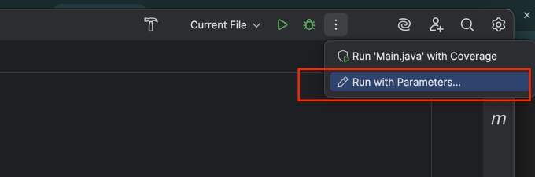
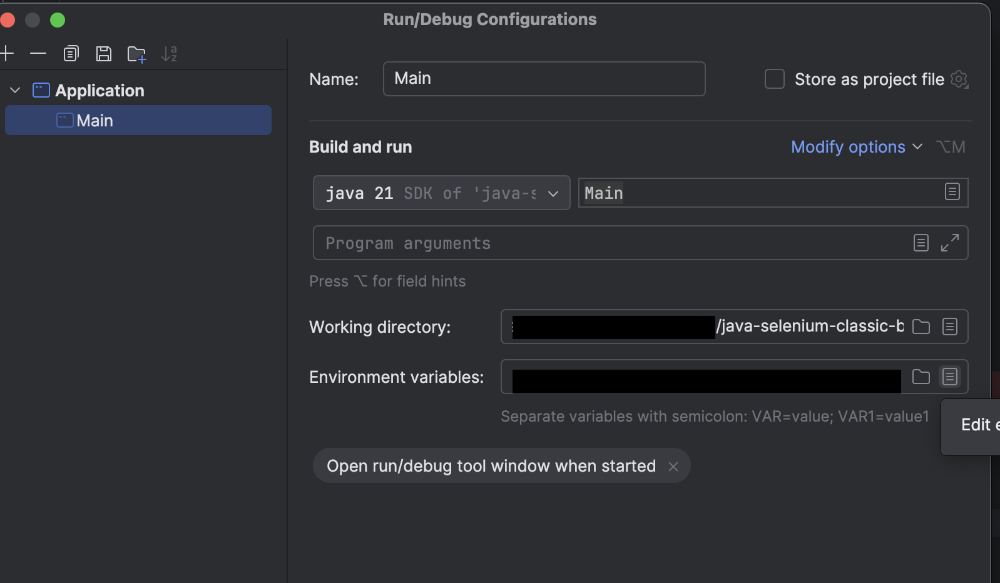
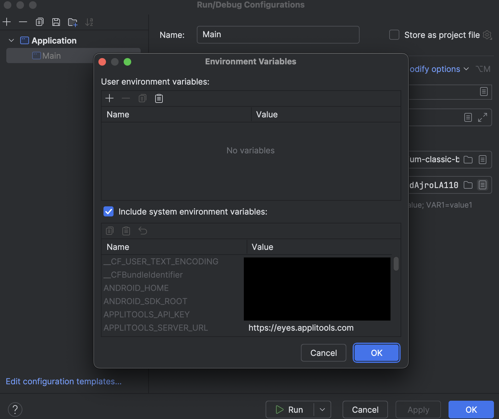
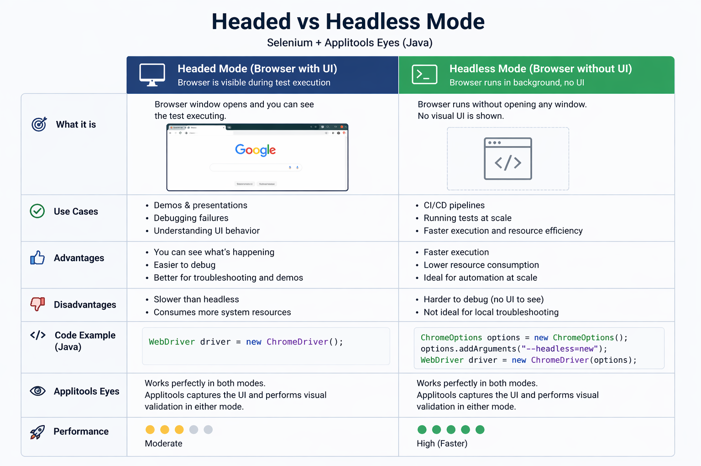

# Applitools Java Classic Demo

### Setup API Key

Set your `APPLITOOLS_API_KEY` as an environment variable.
### Option 1: Using IntelliJ
Follow the steps shown below:







Headless vs Headed


#### Headed (for demo)
```
java Main
```
#### Headless (for CI)
```
java -Dheadless=true Main
```